# 📸 SnapSync AI

> AI-powered collaborative photo sharing platform with semantic search, face recognition, duplicate detection, automatic categorization, and original-quality image sharing.

---

## 🚀 Overview

SnapSync AI is a Flutter + FastAPI application that helps groups share photos in original quality while using AI to organize and search memories.

Instead of manually scrolling through hundreds of photos, users can:

- 🔍 Search photos using natural language
- 👤 Find photos of themselves using face recognition
- 🖼️ Detect similar photos
- 🗑️ Detect duplicate photos automatically
- ⭐ Keep the best quality duplicate
- 📂 Browse photos by AI-generated categories
- 🤖 Generate captions for uploaded photos

## 🛠️ Tech Stack

### Mobile
- Flutter
- Riverpod
- Firebase Authentication
- Cloud Firestore
- Cloudinary

### Backend
- FastAPI
- Python
- SQLite

### AI & Machine Learning
- OpenCLIP
- InsightFace
- Perceptual Hash (pHash)
- Pillow
- OpenCV

### Cloud Services
- Firebase
- Cloudinary

### Tools
- Git
- GitHub
- VS Code

## ✨ Features

### 📸 Photo Sharing
- Create and join private photo-sharing rooms
- Upload original-quality photos
- Secure cloud storage using Cloudinary
- Real-time synchronization with Firebase

### 🤖 AI Features
- 👤 Face Recognition (Find My Photos)
- 🔍 Semantic Photo Search using natural language
- 🖼️ Similar Photo Detection
- 🗂️ Automatic Photo Categorization
- 📝 AI Caption Generation
- 🗑️ Duplicate Photo Detection
- ⭐ Best Quality Photo Selection

### 🔒 Security
- Firebase Authentication
- Room-based access control
- Private AI indexing for authorized users only

### ⚡ Performance
- Optimized AI indexing
- Fast semantic search
- Automatic background photo processing

## 📸 Application Screenshots

### Authentication

| Login | Gallery |
|-------|---------|
| 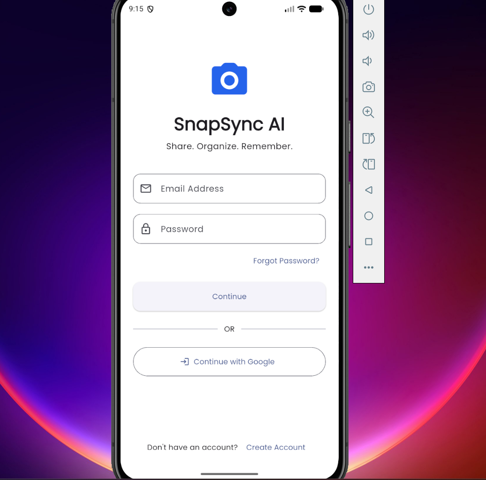 | 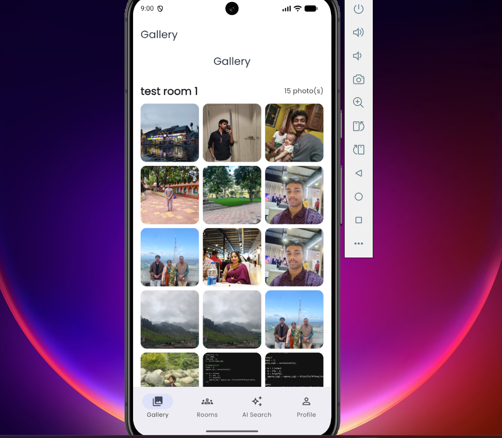 |

---

### Room Management

| Rooms | Room Details |
|-------|--------------|
| 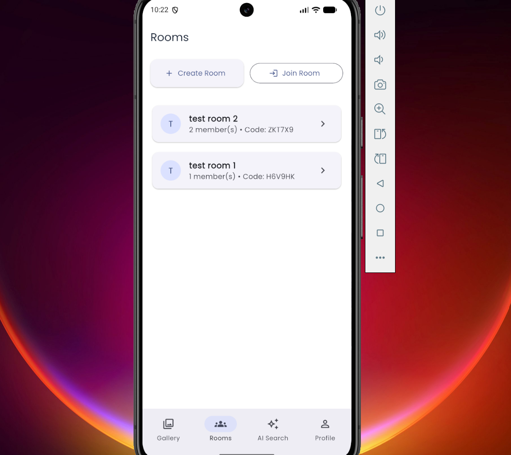 |  |

| Join Room |
|----------|
| 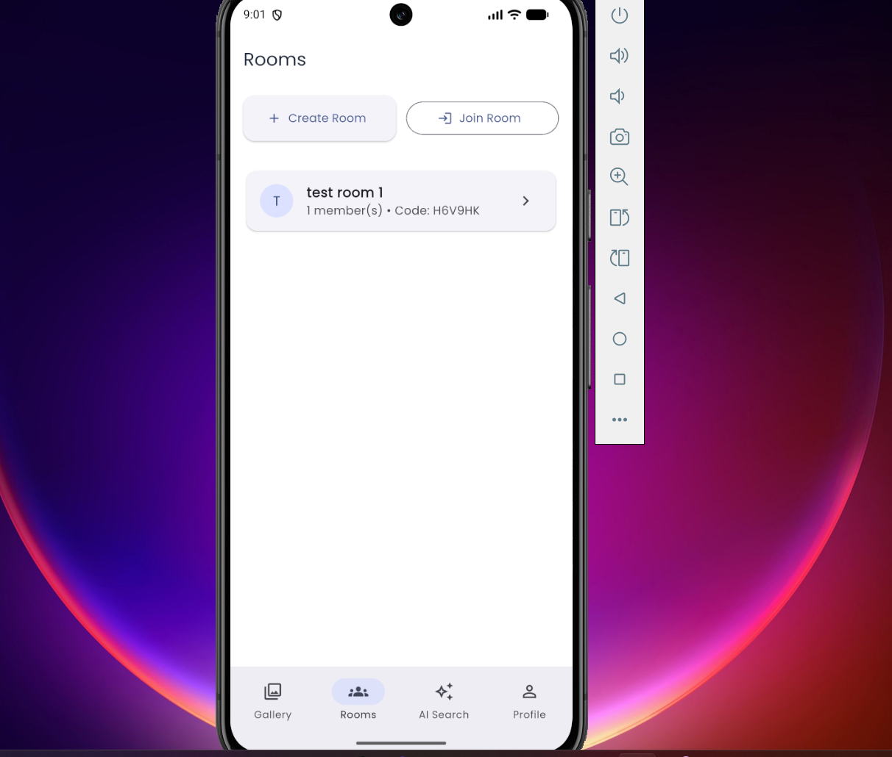 |

---

### AI Features

| Face Search | AI Search |
|------------|-----------|
| 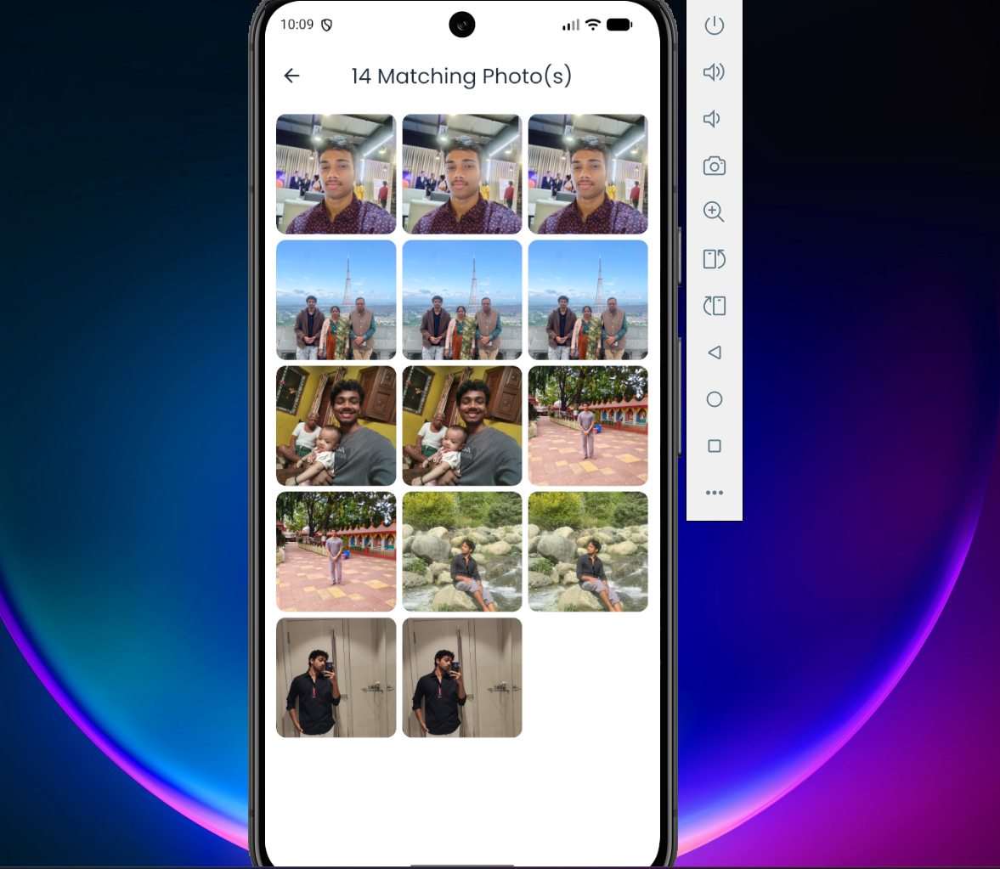 | 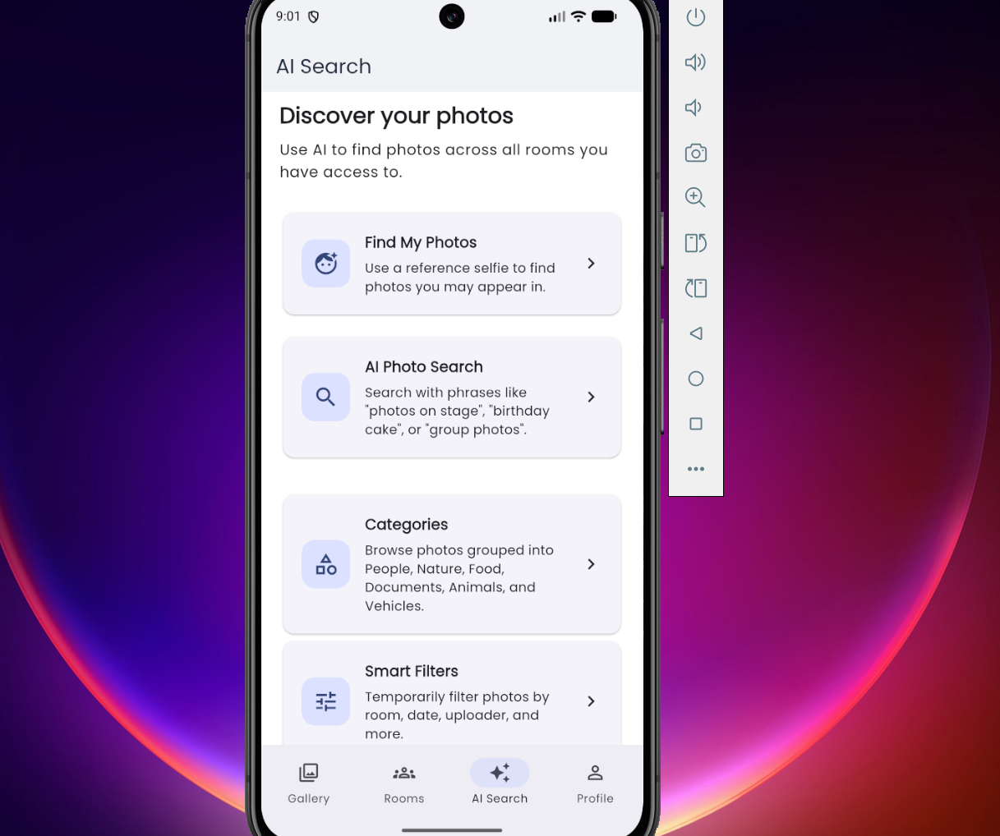 |

| AI Photo Search | Categories |
|----------------|------------|
| 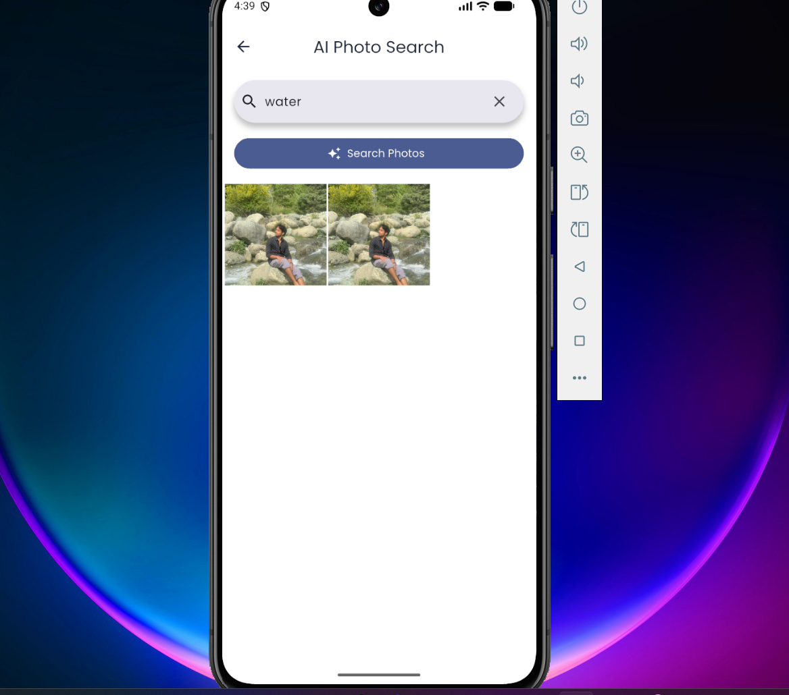 | 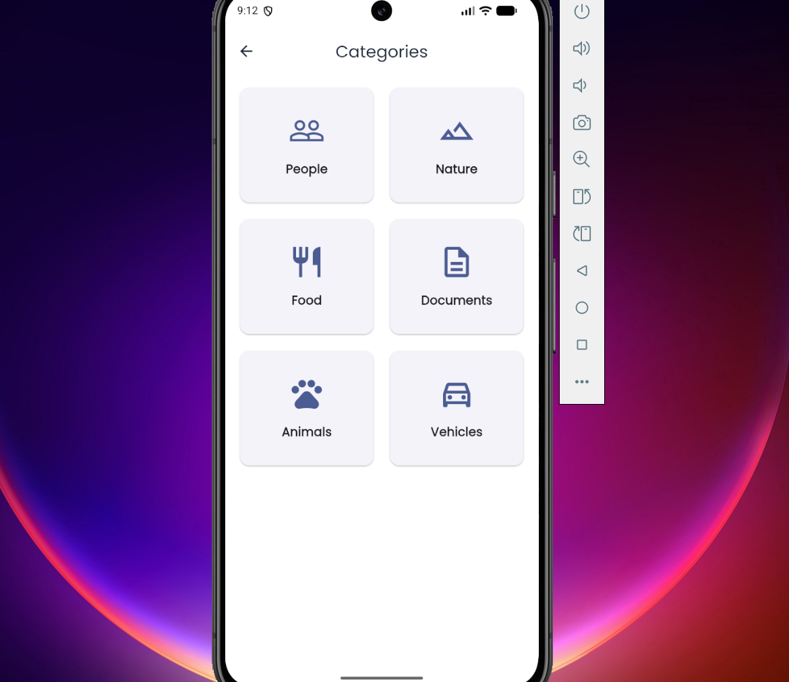 |

| Duplicate Groups | Similar Photos |
|-----------------|----------------|
| 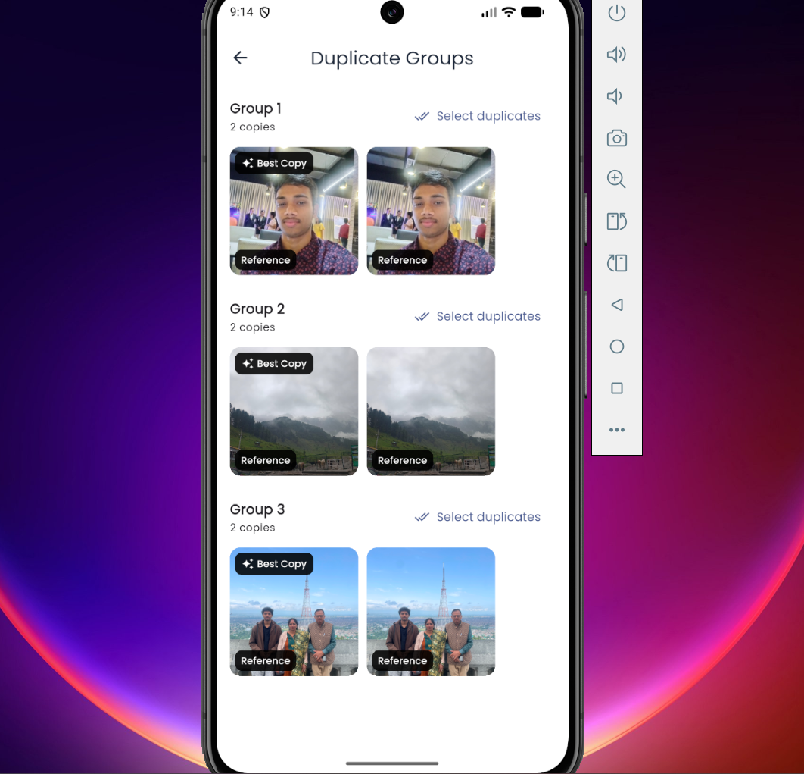 | 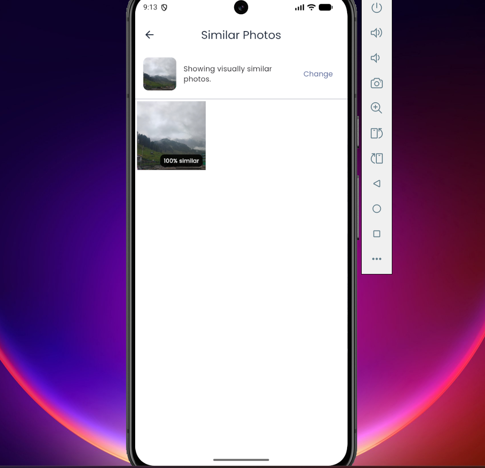 |

---

### Profile

| Profile |
|---------|
| 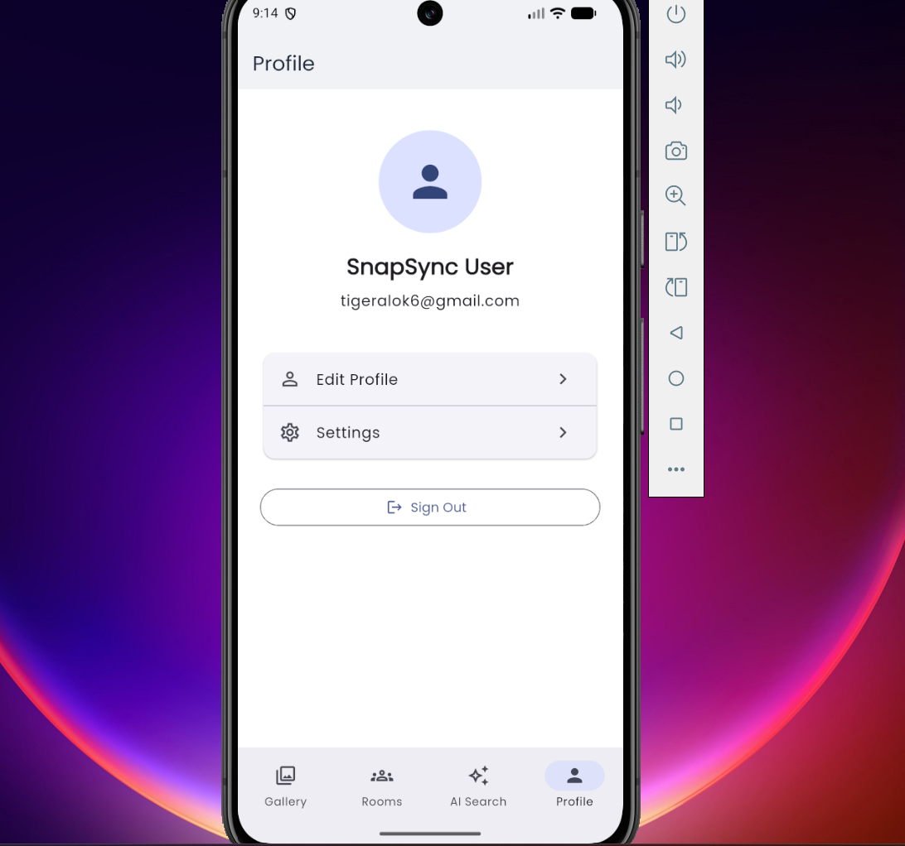 |